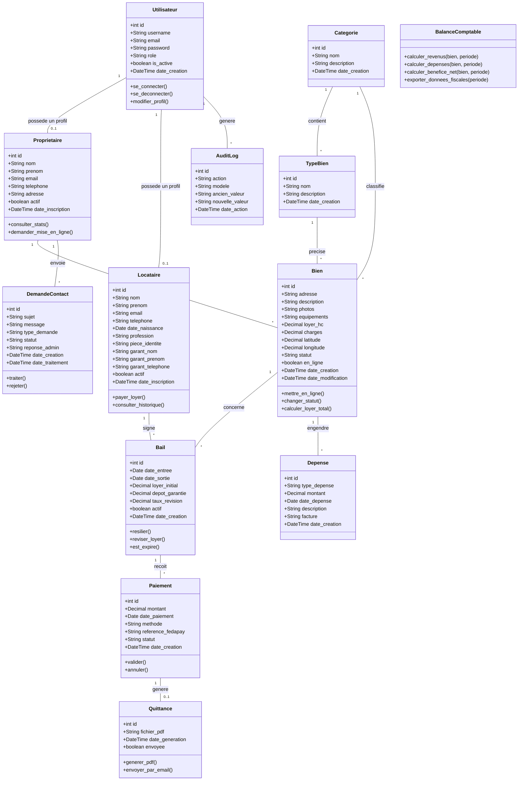
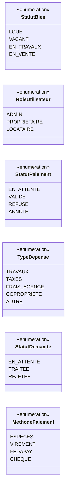

# Diagramme de Classes UML - Location & Vente Immobilier

## Diagramme de Classes Global

## Detail des Relations

| Relation | Cardinalite | Description |
|----------|-------------|-------------|
| Utilisateur - Proprietaire | 1 --- 0..1 | Un utilisateur peut avoir un profil proprietaire |
| Utilisateur - Locataire | 1 --- 0..1 | Un utilisateur peut avoir un profil locataire |
| Utilisateur - AuditLog | 1 --- * | Un utilisateur genere plusieurs logs |
| Proprietaire - Bien | 1 --- * | Un proprietaire possede plusieurs biens |
| Proprietaire - DemandeContact | 1 --- * | Un proprietaire peut envoyer plusieurs demandes |
| Categorie - TypeBien | 1 --- * | Une categorie contient plusieurs types |
| Categorie - Bien | 1 --- * | Une categorie classifie plusieurs biens |
| TypeBien - Bien | 1 --- * | Un type precise plusieurs biens |
| Bien - Bail | 1 --- * | Un bien peut avoir plusieurs baux dans le temps |
| Bien - Depense | 1 --- * | Un bien peut avoir plusieurs depenses |
| Locataire - Bail | 1 --- * | Un locataire peut signer plusieurs baux |
| Bail - Paiement | 1 --- * | Un bail recoit plusieurs paiements mensuels |
| Paiement - Quittance | 1 --- 0..1 | Un paiement genere une quittance |

## Enumeration des Statuts

